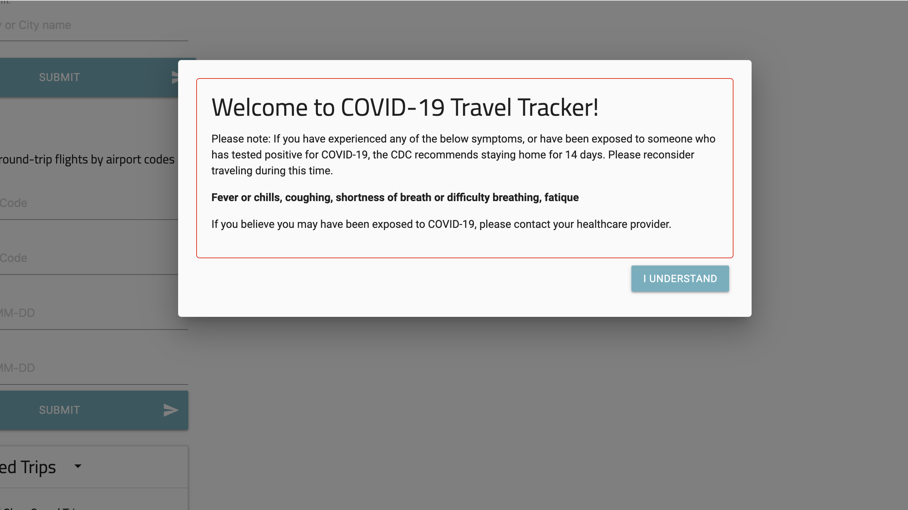
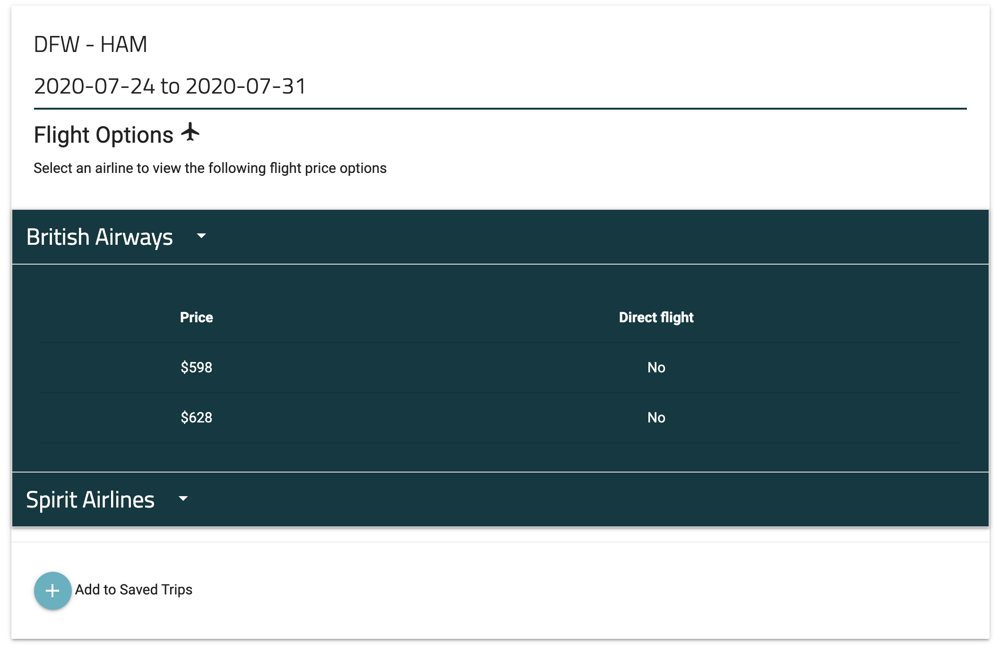

# COVID Travel Tracker

## Purpose
Because of quarantine, many people have a strong desire to travel, but they also want to be safe when traveling. By creating this application, we are providing our users with the knowledge of both the COVID statistics surrounding their destination and flight options all in one place. 

This application allows the user to input their desired airport codes and travel dates. Upon submission, the page will load with the statistics of new cases, total cases, new deaths, and total deaths in relation to their destination country. It will also shows a recent news update for that location which is supported by a link to that article. Additionally, the page will display the flight price options associated with the city pairs and dates provided. 

If the user is unaware of the specific airport code they need to search, there is also a search function within the application that allows the user to search by city or country name. The application will return all the airport codes associated with that area to the page.

The user can easily save their searched trip to the page. Using Local Storage, these saved trips will persist to the page and the COVID data and flight options surrounding that trip can be reloaded (with any updated information) if the list item is clicked. If user desires to clear their saved trips, they do have the option to clear local storage on button click.

## Built With
* HTML
* CSS
* Javascript
* JQuery
* Materlialize
* 3rd Party APIs Used 
	- TravelAdvice: https://traveladviceapi.com/
	- Trip Advisor: https://rapidapi.com/apidojo/api/tripadvisor1
	- Sky Scanner: https://rapidapi.com/user/skyscanner

## Screenshots of Application
Full Screen

Intro Modal

Airport Code Search

Collapsible Flight Options

## Deployed Website
https://d-belleza.github.io/covid-traveling/

## GitHub Link
https://github.com/d-belleza/covid-traveling.git
